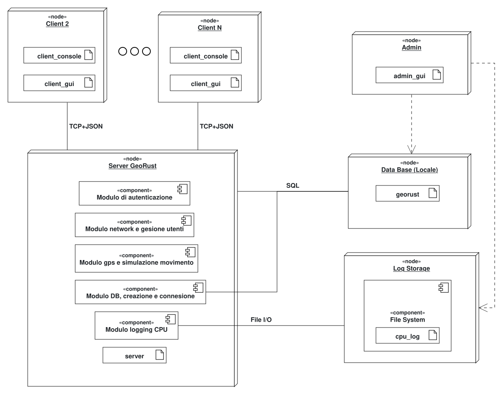

# Manuale del Progettista

## GeoRust: Sistema di geolocalizzazione per una flotta di veicoli

**Gruppo 15: Pasquinelli, Danesi, Casale, Giordano**

---

## Descrizione

Nel documento viene spiegato il dettaglio implementativo dell'applicazione GeoRust, motivando le scelte progettuali fatte per ciascun modulo del sistema. Vengono illustrate le decisioni prese a livello architetturale e le ragioni dietro di esse, così da fornire una guida di riferimento per comprendere non solo come è strutturato il codice, ma anche perché è stato realizzato in un determinato modo.

---

## Pianificazione

Il progetto è stato organizzato in moduli separati, in modo da distinguere le responsabilità principali dell'applicazione:

- autenticazione e gestione delle password
- accesso al database
- simulazione e analisi delle posizioni GPS
- gestione dello stato dei veicoli
- comunicazione client/server
- logging del consumo CPU
- interfacce utente e programmi di test

L'implementazione utilizza Rust con Tokio per la gestione asincrona della rete e SQLite per la persistenza dei dati.

---

## Architettura del Sistema

Il sistema segue un'architettura client/server. Il server rimane in ascolto su una porta TCP e gestisce più client contemporaneamente tramite task asincroni indipendenti.



I moduli sono organizzati nelle seguenti cartelle:

- `auth/` → registrazione e autenticazione
- `db/` → accesso al database
- `gps/` → simulazione e gestione delle posizioni
- `logging/` → monitoraggio CPU
- `network/` → comunicazione client/server
- `bin/` → eseguibili, interfacce GUI/CLI e programmi di test

---

## 1. Autenticazione → `auth/`

La gestione dell'autenticazione è separata all'interno della cartella `auth/`, suddivisa in tre componenti:

```text
auth/
├── hash.rs
├── login.rs
└── register.rs
```

- `hash.rs` → gestione dell'hashing e della verifica delle password
- `register.rs` → registrazione di nuovi utenti
- `login.rs` → autenticazione degli utenti già registrati

La separazione permette di mantenere il codice modulare: `register` e `login` non implementano direttamente gli algoritmi di hashing, ma si interfacciano con le funzioni messe a disposizione da `hash.rs`.

### 1.1 Hashing delle password → `hash.rs`

Il file `hash.rs` espone due funzioni pubbliche:

```rust
pub fn hash_password(password: &str) -> Result<String, AuthError>
pub fn verify_password(password: &str, password_hash: &str) -> Result<bool, AuthError>
```

**Scelta dell'algoritmo: SHA-256 con salt**

Per l'hashing è stato scelto **SHA-256**, principalmente per la richiesta progettuale di porre attenzione al carico computazionale. SHA-256 è significativamente più veloce di alternative come Argon2 o bcrypt, pur offrendo una resistenza sufficiente per il contesto applicativo.

Il problema dell'utilizzo diretto di SHA-256 è che, a parità di password, si otterrebbe sempre lo stesso hash. Per evitarlo viene utilizzato un **salt casuale** di 16 byte generato ad ogni chiamata:

```rust
let mut salt = [0u8; 16];
rand::rng().fill(&mut salt);
```

Password e salt vengono concatenati e passati a SHA-256. Il risultato viene memorizzato nel formato:

```
<salt_hex>:<hash_hex>
```

In questo modo due utenti con la stessa password producono valori memorizzati completamente diversi.

**Verifica**: `verify_password()` separa il salt dall'hash, ricalcola SHA-256 sulla password fornita con lo stesso salt e confronta il risultato. Non viene mai recuperata la password originale.

**Perché non Argon2?** Argon2 è più sicuro contro attacchi brute-force (è volutamente lento), ma il progetto richiede attenzione al consumo CPU. Per un sistema di flotta aziendale dove le password sono gestite internamente, SHA-256 con salt rappresenta un compromesso ragionevole tra sicurezza e prestazioni.

### 1.2 Registrazione → `register.rs`

```rust
pub fn register_user(connection: &Connection, credentials: &UserCredentials) -> Result<User, AuthError>
```

Il flusso è:

1. Normalizzazione dello username con `trim()`
2. Validazione degli input (username non vuoto, password ≥ 4 caratteri)
3. Delega a `hash.rs` per il calcolo dell'hash
4. Inserimento nel database tramite `db::users::insert_user()`

La password in chiaro non viene mai passata al database.

### 1.3 Login → `login.rs`

```rust
pub fn login_user(connection: &Connection, credentials: &UserCredentials) -> Result<User, AuthError>
```

Il flusso è:

1. Ricerca dell'utente nel database tramite username
2. Se non trovato → `Err(AuthError::InvalidCredentials)`
3. Delega a `hash.rs` per la verifica della password
4. Se la verifica fallisce → `Err(AuthError::InvalidCredentials)`

**Scelta di sicurezza**: viene restituito lo stesso errore sia per username inesistente sia per password errata. Questo impedisce a un attaccante di distinguere i due casi (user enumeration attack).

### 1.4 Interazione tra i moduli

Il principio seguito è:

**`register` e `login` decidono cosa fare, `hash` gestisce le password, `db` gestisce la persistenza.**

---

## 2. Database → `db/`

```text
db/
├── connection.rs
├── users.rs
└── positions.rs
```

L'accesso al database è gestito da `rusqlite`, una libreria Rust per SQLite.

### 2.1 Schema del Database

La funzione `init_db()` in `connection.rs` crea le tabelle se non esistono:

```sql
CREATE TABLE IF NOT EXISTS users(
    id INTEGER PRIMARY KEY AUTOINCREMENT,
    username TEXT NOT NULL UNIQUE,
    password_hash TEXT NOT NULL,
    created_at TEXT NOT NULL DEFAULT (datetime('now'))
);

CREATE TABLE IF NOT EXISTS positions(
    id INTEGER PRIMARY KEY AUTOINCREMENT,
    username TEXT NOT NULL,
    lat REAL NOT NULL,
    lon REAL NOT NULL,
    timestamp TEXT NOT NULL DEFAULT (datetime('now'))
);
```

Il vincolo `UNIQUE` su `username` garantisce l'unicità a livello di database, gestita come `DbError::UserAlreadyExists`.

### 2.2 Accesso Thread-Safe: `Arc<Mutex<Connection>>`

`rusqlite::Connection` non è `Send + Sync`, quindi non può essere condivisa direttamente tra thread. La soluzione adottata è avvolgerla in `Arc<Mutex<Connection>>` all'interno di `AppState`.

Ogni accesso al DB avviene **esclusivamente dentro `tokio::task::spawn_blocking`**, perchè che rusqlite è bloccante, quindi isoliamo tutte le operazioni SQLite dal normale runtime asincrono di Tokio.

```rust
//handler.rs
let db_arc = state.db_arc();
let result = task::spawn_blocking(move || {
    let conn = db_arc.lock().expect("DB Mutex avvelenato");
    login_user(&conn, &credentials)
}).await;
```

### 2.3 Funzioni principali

**`users.rs`**:

- `insert_user()`: usa `RETURNING` per ottenere tutti i dati in una singola query (evita il doppio round-trip)
- `find_user_by_username()`: usa `prepare_cached()` per riutilizzare lo statement compilato su chiamate ripetute
- `get_all_users()`: restituisce tutti gli utenti ordinati alfabeticamente

**`positions.rs`**:

- `insert_position()`: salva lat, lon e username; il timestamp è generato automaticamente da SQLite
- `get_positions_by_user()`: recupera tutte le posizioni ordinate per timestamp crescente, poi per id come criterio di spareggio

---

## 3. GPS → `gps/`

```text
gps/
├── analytics.rs
├── simulator.rs
└── state.rs
```

### 3.1 Simulatore → `simulator.rs`

```rust
pub async fn run_simulation(file_path: &str, tx: mpsc::Sender<(f64, f64)>, interval_ms: u64)
    -> Result<(), Box<dyn std::error::Error>>
```

Il simulatore legge un file CSV riga per riga usando I/O asincrono (`tokio::fs::File`, `AsyncBufReadExt`), ed emette le coordinate su un canale `mpsc` con un intervallo configurabile. Viene usato il timer di `tokio::time::interval` per garantire la cadenza esatta di 30 secondi senza occupare thread.

**Perché un canale `mpsc` invece di restituire direttamente le coordinate?**

Il simulatore gira in un task separato (`tokio::spawn`). Il canale `mpsc` è il meccanismo standard per comunicare tra task Tokio senza condivisione di stato: il produttore (simulatore) e il consumatore (loop di rete) sono completamente disaccoppiati.

### 3.2 Analisi del Movimento → `analytics.rs`

Le funzioni principali:

```rust
pub fn calculate_distance_km(lat1: f64, lon1: f64, lat2: f64, lon2: f64) -> f64
pub fn filter_positions_by_timerange<'a>(positions: &'a [Position], range: TimeRange, now: DateTime<Utc>) -> Vec<&'a Position>
pub fn analyze_movement(positions: &[Position]) -> MovementAnalytics
```

**Formula di Haversine**

Per il calcolo della distanza tra due coordinate geografiche viene usata la formula di Haversine, che tiene conto della curvatura della Terra:

```
a = sin²(Δlat/2) + cos(lat1) · cos(lat2) · sin²(Δlon/2)
c = 2 · atan2(√a, √(1-a))
d = R · c    (R = 6371 km)
```

**Filtro temporale**

`filter_positions_by_timerange()` filtra le posizioni in base all'intervallo scelto (`TimeRange`): oggi, settimana corrente, mese corrente o tutto lo storico. Il filtro confronta le date tramite `chrono`, gestendo correttamente i timestamp nel formato SQLite.

**Analisi**

`analyze_movement()` scorre le posizioni a coppie (finestre di 2 elementi): se la distanza tra due posizioni consecutive supera la soglia di 5 metri, l'intervallo è considerato "in movimento"; altrimenti "di sosta". Questo permette di calcolare distanza totale, velocità media e durata movimento/sosta.

**Soglia di movimento: 5 metri**

Una soglia nulla causerebbe falsi positivi per il GPS noise (piccole variazioni nelle coordinate anche a veicolo fermo). 5 metri è un valore che filtra il rumore senza perdere spostamenti reali.

### 3.3 Stato dell'Utente → `state.rs`

```rust
pub struct UserTracker {
    pub username: String,
    pub current_state: UserState,
    pub last_lat: Option<f64>,
    pub last_lon: Option<f64>,
    pub last_update_time: Option<DateTime<Utc>>,
    pub last_moved_time: Option<DateTime<Utc>>,
}
```

`UserTracker` implementa la macchina a stati che regola le transizioni tra `Sconnesso`, `Fermo` e `InMovimento`:

| Da \ A      | Sconnesso            | Fermo                    | InMovimento   |
| ----------- | -------------------- | ------------------------ | ------------- |
| Sconnesso   | -                    | Prima posizione ricevuta | -             |
| Fermo       | `set_disconnected()` | Posizione invariata      | distanza > 5m |
| InMovimento | `set_disconnected()` | Immobile da ≥ 180s       | distanza > 5m |

Il campo `last_moved_time` memorizza l'ultimo istante in cui è stato rilevato un movimento, ogni aggiornamento di posizione controlla l'elapsed time da quel momento.

---

## 4. Rete → `network/`

```text
network/
├── app_state.rs
├── handler.rs
├── protocol.rs
├── server_console.rs
├── client_console.rs
└── state.rs
```

### 4.1 Protocollo di Comunicazione → `protocol.rs`

Tutta la comunicazione TCP è basata su messaggi **JSON separati da newline** (`\n`), gestiti tramite `LinesCodec` di `tokio-util`. Questo approccio garantisce che ogni messaggio venga letto completo, evitando problemi di frammentazione.

```rust
pub enum ClientMessage {
    Login { username: String, password_hash: String },
    Register { username: String, password_hash: String },
    UpdatePosition { lat: f64, lon: f64 },
    StartSimulation { lat: f64, lon: f64, speed: f64 },
    SendDirectText { text: String },
    Disconnect,
}

pub enum ServerMessage {
    AuthResult { success: bool, msg: String },
    CoordUpdate { lat: f64, lon: f64 },
    Error { reason: String },
    SendDirectText { target_user: String, text: String },
    SendBroadcastText { text: String },
}
```

### 4.2 Stato Condiviso del Server → `state.rs` e `app_state.rs`

**`ServerState`** mantiene la mappa degli utenti online:

```rust
pub struct ServerState {
    pub online_users: HashMap<String, ClientSender>,
}

pub type ClientSender = mpsc::Sender<String>;
```

La chiave è l'username, il valore è un canale `mpsc::Sender<String>`. Quando il server vuole inviare un messaggio a un client specifico, non scrive direttamente sul socket TCP: inserisce il messaggio nel canale del client, e il task dedicato a quel client si occupa di trasmettere fisicamente il dato sul socket.

Il socket TCP è posseduto dal task writer del client. Non può essere condiviso direttamente tra task senza `Arc<Mutex<>>`. La nostra scelta è stata quella di usare `mpsc`, il `Sender` è `Clone` e può essere condiviso liberamente, mentre il `Receiver` appartiene solo al task writer.

**`AppState`** è il tipo che incapsula tutto lo stato condiviso:

```rust
#[derive(Clone)]
pub struct AppState {
    state: Arc<RwLock<ServerState>>,
    db: Arc<Mutex<Connection>>,
}
```

`AppState` incapsula entrambi e li espone tramite metodi:

```rust
pub fn with_state<F, R>(&self, f: F) -> R     // lock read
pub fn with_state_mut<F, R>(&self, f: F) -> R  // lock write
pub fn db_arc(&self) -> Arc<Mutex<Connection>> // per spawn_blocking
```

Questi metodi rendono **esplicito nel codice** il pattern corretto: il lock viene sempre acquisito, usato nella closure e rilasciato prima di restituire il risultato, mai tenuto attraverso un `.await`.

### 4.3 Gestione dei Client → `handler.rs`

```rust
pub async fn handle_client(stream: TcpStream, state: AppState)
```

**Architettura: una task per connessione TCP**

Ogni client viene gestito tramite una task Tokio dedicata (`tokio::spawn(handle_client(stream, state))`). Questo permette al server di gestire più client contemporaneamente in modo efficiente. Le task Tokio sono più leggere rispetto ai thread tradizionali, poiché vengono eseguite in modo asincrono e possono essere distribuite dal runtime Tokio tra i thread del suo pool, evitando di dedicare un thread separato a ogni client.

**Split delle socket e writer task dedicato**

```rust
let framed = Framed::new(stream, LinesCodec::new());
let (mut tx, mut rx) = framed.split();

let (mpsc_tx, mut mpsc_rx) = mpsc::channel::<String>(32);

// Writer task: invia i messaggi dal canale mpsc al socket TCP
tokio::spawn(async move {
    while let Some(msg) = mpsc_rx.recv().await {
        if tx.send(msg).await.is_err() {
            break; // Socket non più scrivibile: uscita immediata
        }
    }
});
```

Il socket viene diviso in lettura (`rx`) e scrittura (`tx`). La parte di scrittura viene affidata a un task separato, mentre il loop principale si occupa solo di leggere i messaggi in arrivo. Questo struttara è necessaria perché:

1. Il lato di scrittura del socket non è `Clone`
2. Altri task (es: chi gestisce il broadcast) devono poter inviare messaggi a questo client
3. Il canale `mpsc` è il meccanismo standard per passare il possesso di dati tra task

**Aggiornamento della posizione `UpdatePosition`**

```rust
// Login/Register: await necessario perché serve il risultato
let result = task::spawn_blocking(move || { ... }).await;

// UpdatePosition: non serve il risultato dopo la lettura
let _handle = task::spawn_blocking(move || {
    let conn = db_arc.lock().expect("DB Mutex avvelenato");
    insert_position(&conn, &uname_clone, lat, lon);
});
// Il loop messaggi riprende immediatamente, senza attendere la scrittura su disco
```

Per login e registrazione il `.await` è necessario perché il risultato determina la risposta da inviare al client. Per l'aggiornamento delle posizioni, la risposta non dipende dall'esito della scrittura: il loop messaggi può continuare senza aspettare i millisecondi di I/O su disco.

**Cosa succede con due login simultanei?**

Con 100 client che si autenticano contemporaneamente, ogni client ha la sua task Tokio. Ognuna chiama `spawn_blocking` che mette il lavoro nel thread pool di Tokio. Il `Mutex` sul DB serializza gli accessi: ogni thread del pool attende il suo turno. Non ci sono deadlock né race condition perché:

- Il `Mutex` viene acquisito e rilasciato dentro `spawn_blocking`
- Nessun `.await` avviene mentre il lock è tenuto

### 4.4 Console Server → `server_console.rs`

La console interattiva gira in `task::spawn_blocking` per non bloccare il loop di accettazione TCP. Legge stdin in modo sincrono e usa `blocking_send` per inviare messaggi ai client.

Il comando `stats` accede al DB direttamente e mostra: utenti online, totale utenti registrati, posizioni per utente e totale posizioni nel DB.

---

## 5. Logging CPU → `logging/`

```rust
pub async fn start_cpu_logger()
```

Il logger avvia un task async che:

1. Campiona due volte il consumo CPU (con 500ms di attesa tra i campioni) per una misura iniziale accurata
2. Ogni 2 minuti aggiorna il file `cpu_log.txt` con il tempo CPU totale e il percentuale di utilizzo nell'intervallo
3. Usa `tokio::fs` per la scrittura asincrona su disco, senza bloccare i worker del server

**Perché due campioni all'avvio?**

`sysinfo` calcola il consumo CPU come delta tra due misurazioni. Una singola misurazione produce 0% (nessun delta calcolato). I due campioni iniziali con 500ms di pausa garantiscono una misura corretta già dal primo log.

---

## 6. Interfacce → `bin/`

```text
bin/
├── server.rs        → server TCP
├── client.rs        → client CLI
├── client_gui.rs    → client GUI
├── admin_gui.rs     → console amministratore
└── stress_test.rs   → test di carico
```

### 6.1 Server → `server.rs`

```rust
let state = AppState::new(conn);
georust::network::server_console::start_server_console(state.clone());

loop {
    let (stream, _) = listener.accept().await?;
    let state_clone = state.clone();
    tokio::spawn(async move {
        handle_client(stream, state_clone).await;
    });
}
```

Il server mantiene un unico `AppState` clonato per ogni nuova connessione. `AppState` implementa `Clone`.

### 6.2 Client GUI → `client_gui.rs`

La GUI usa `eframe`/`egui` che richiede il thread principale per il rendering. Il networking async viene eseguito su un **runtime Tokio dedicato** (multi-thread, 2 worker) creato all'avvio:

```rust
let runtime = tokio::runtime::Builder::new_multi_thread()
    .enable_all()
    .worker_threads(2)
    .thread_name("georust-client-rt")
    .build()
    .expect("Impossibile avviare il runtime Tokio in background");
```

La GUI comunica con i task async tramite canali `mpsc` non bloccanti:

- `tx_to_server`: GUI → task writer → socket TCP
- `rx_from_server`: socket TCP → task reader → GUI (letto con `try_recv()` ad ogni frame)
- `rx_gps`: simulatore GPS → GUI (per aggiornare le coordinate visualizzate)

**`try_recv()` invece di `recv().await`**

La funzione `update()` di egui viene chiamata ad ogni frame (ogni ~16ms). Non può essere `async` né bloccarsi. `try_recv()` restituisce immediatamente `Err(TryRecvError::Empty)` se non ci sono messaggi, permettendo alla GUI di continuare il rendering senza interruzioni.

**`Arc<AtomicBool>` per il tasto "Simula Fermo"**

```rust
is_stopped: Arc<AtomicBool>,
```

Il flag viene letto dal task GPS (in background) e scritto dal thread GUI. `AtomicBool` è la scelta che abbiamo adottato per una variabile booleana condivisa tra thread: non richiede lock e le operazioni atomiche sono garantite a livello hardware.

### 6.3 Console Amministratore → `admin_gui.rs`

Stessa architettura del client GUI, con funzionalità aggiuntive:

- Connessione diretta al database SQLite (lato admin, lettura diretta per la flotta e le statistiche)
- Auto-refresh ogni 2 secondi della lista veicoli e dei log CPU
- Login come `ADMIN_CONSOLE` per distinguersi dai client normali nel server

---

## 7. Modelli di Dati → `models.rs`

```rust
pub struct User { pub id: i64, pub username: String, pub password_hash: String, pub created_at: String }
pub struct Position { pub id: i64, pub username: String, pub lat: f64, pub lon: f64, pub timestamp: String }
pub struct UserCredentials { pub username: String, pub password: String }
pub struct MovementAnalytics { pub total_distance_km: f64, pub average_speed_kmh: f64, pub moving_duration_secs: i64, pub stopped_duration_secs: i64 }
pub enum UserState { Sconnesso, Fermo, InMovimento }
pub enum TimeRange { Today, ThisWeek, ThisMonth, AllTime }
```

**Perché `String` per i timestamp invece di `DateTime<Utc>`?**

SQLite non ha un tipo nativo per i datetime: li memorizza come stringhe. `rusqlite` li restituisce come `String`. Convertirli immediatamente in `DateTime<Utc>` richiederebbe gestire il fallimento del parsing in ogni query. La scelta di mantenerli come `String` nelle struct del DB sposta la conversione al momento dell'uso effettivo (es. in `analytics.rs`), dove il contesto rende più chiaro come gestire un timestamp non parsabile.

**Perché `Copy` su `UserState` e `TimeRange`?**

Sono enum senza dati associati (solo varianti unit). `Copy` permette di passarli per valore senza `clone()`, rendendo il codice più idiomatico. `Clone` è derivato automaticamente quando si deriva `Copy`.

---

## 8. Gestione degli Errori → `errors.rs`

```rust
pub enum DbError {
    Sqlite(#[from] rusqlite::Error),
    UserAlreadyExists(String),
    NotFound,
}

pub enum AuthError {
    Db(#[from] DbError),
    InvalidCredentials,
    PasswordHashError(String),
    InvalidInput(String),
}
```

**Perché `thiserror`?**

`thiserror` genera automaticamente le implementazioni di `std::error::Error` e `Display` tramite derive macro, eliminando codice boilerplate. La macro `#[from]` genera automaticamente la conversione da un tipo di errore all'altro (es. da `rusqlite::Error` a `DbError::Sqlite`), permettendo l'uso dell'operatore `?` tra livelli diversi.

**Gerarchia degli errori**

Gli errori sono organizzati gerarchicamente: `DbError` è il livello più basso (wrappa gli errori di SQLite), `AuthError` è il livello applicativo e include `DbError` come variante. Questo permette di propagare errori dal database fino all'handler di rete senza perdere il contesto originale.

---

## 9. Flusso di Comunicazione Completo

L'utilizzo del diagramma di sequenza è stato scelto per visualizzare il flusso di comunicazione tra client e server, e tra server e database. La notazione UML adottata non è formale ne corretta dal punto di vista puramente teorico, è utile solo per capire al meglio il funzionamento dell'applicazione.

**Registrazione:**


**Login:**


**Simulazione movimemnto:**


**Mesasggio del client:**


**Messaggio boradcast da parte del server:**


---

## 10. Prestazioni

Vedere il documento `prestazioni.md` per i dati completi. Punti chiave:

- **Dimensione eseguibili**:`server.exe`: ~2.7 MB,`client.exe`: ~2.3 MB, `client_gui.exe`: ~6.3 MB,`admin_gui.exe`: ~6.4 MB
- **Consumo CPU sotto stress** (100 client, 200 aggiornamenti GPS/sec): ~31-33% CPU
- **Memoria**: ~6 MB RAM con 2 client attivi, (100 Bot Attivi) ~26 MB
- **Latenza**: < 1 ms per ciclo send-broadcast su interfaccia locale
- **Multipiattaforma**: testato su Windows, Linux e MacOS
